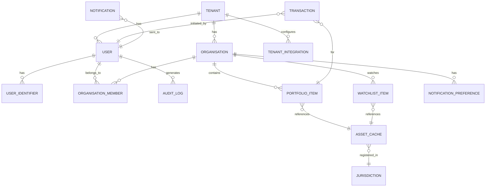

# Temmy Portal - Data Model

## Archive Notice

This document is archived reference material from the earlier portal and multi-tenant architecture direction.

It is not the active data model for the TMH Commerce Extension.

Use `TMH_Commerce_Extension_Canonical_Domain_Model_v1.md` and related canonical docs for current implementation work.

## Document Info
- **Version:** 1.1
- **Date:** February 2026
- **Status:** Updated for Multi-Tenancy & Vercel/Neon Stack

---

## Tech Stack

| Layer | Technology | Notes |
|-------|------------|-------|
| **Framework** | Next.js 14+ (App Router) | Vercel deployment |
| **Database** | Neon (Serverless Postgres) | Branching for preview deploys |
| **ORM** | Prisma | Type-safe, migrations |
| **Auth** | NextAuth.js v5 (Auth.js) | Flexible for white-label |
| **UI** | shadcn/ui + Radix UI | — |

---

## Data Ownership & Sync Strategy

| Data | Source of Truth | Portal DB Role | Sync Method |
|------|-----------------|----------------|-------------|
| **Trademarks** | IPO/Temmy | On-demand fetch, minimal cache | Request-based (no bulk sync) |
| **Companies** | Companies House | On-demand fetch, minimal cache | Request-based |
| **Organisations (TMH)** | Zoho CRM | Mirror/sync | Event-driven (webhooks) |
| **Organisations (white-label)** | Portal DB | Owns directly | N/A |
| **Users/Auth** | Portal DB | Owns | N/A |
| **Watchlists** | Portal DB | Owns | N/A |
| **Transactions** | Portal DB | Owns | N/A |
| **Notifications** | Portal DB | Owns | N/A |

### Sync Principles

1. **Temmy/IPO**: Fetch on-demand when user views asset. Cache minimally (TTL ~24h or until next view). Don't replicate full registry.
2. **Companies House**: Same as Temmy — fetch on-demand.
3. **Zoho CRM**: Event-driven sync via webhooks. Zoho pushes changes → Portal updates. Portal never writes back to Zoho.
4. **White-label tenants**: Portal DB is authoritative. No external CRM dependency.

---

## Multi-Tenancy Model

**Approach:** Row-level tenancy with `tenant_id` on all tenant-scoped tables.

```
┌─────────────────────────────────────────────────────────────┐
│  TENANT: tmh (The Trademark Helpline)                       │
│  - Zoho CRM integration enabled                             │
│  - Organisations synced from Zoho                           │
└─────────────────────────────────────────────────────────────┘
┌─────────────────────────────────────────────────────────────┐
│  TENANT: partner_x (White-label Partner)                    │
│  - No Zoho integration                                      │
│  - Organisations created directly in portal                 │
└─────────────────────────────────────────────────────────────┘
```

**Isolation enforced via:**
- Prisma middleware adding `tenant_id` filter to all queries
- Row-level security (RLS) policies in Postgres as defense-in-depth

---

## Entity Relationship Diagram



---

## Core Entities

### TENANT

White-label partner or TMH itself. All tenant-scoped data references this.

| Field | Type | Constraints | Description |
|-------|------|-------------|-------------|
| `id` | VARCHAR(50) | PK | Slug identifier (e.g., 'tmh', 'partner_x') |
| `name` | VARCHAR(255) | NOT NULL | Display name |
| `domain` | VARCHAR(255) | UNIQUE, NULL | Custom domain (e.g., 'portal.partner.com') |
| `logo_url` | VARCHAR(500) | NULL | Branding logo |
| `primary_color` | VARCHAR(7) | NULL | Branding color (#hex) |
| `settings` | JSONB | DEFAULT '{}' | Feature flags, config |
| `created_at` | TIMESTAMP | NOT NULL | When onboarded |
| `updated_at` | TIMESTAMP | NOT NULL | Last update |
| `status` | ENUM | NOT NULL | 'active', 'suspended' |

**Notes:**
- TMH is tenant `id = 'tmh'`
- White-label partners get their own tenant record
- `settings` JSONB can store: `{ "zoho_enabled": true, "features": ["renewals", "watchlist"] }`

---

### TENANT_INTEGRATION

External system connections per tenant.

| Field | Type | Constraints | Description |
|-------|------|-------------|-------------|
| `id` | UUID | PK | Primary identifier |
| `tenant_id` | VARCHAR(50) | FK → TENANT | Which tenant |
| `integration_type` | ENUM | NOT NULL | 'zoho_crm', 'stripe', 'webhook' |
| `config` | JSONB | NOT NULL | Encrypted credentials, endpoints |
| `enabled` | BOOLEAN | DEFAULT true | Is integration active? |
| `last_sync_at` | TIMESTAMP | NULL | Last successful sync |
| `created_at` | TIMESTAMP | NOT NULL | When configured |
| `updated_at` | TIMESTAMP | NOT NULL | Last update |

**Notes:**
- Only TMH tenant has `zoho_crm` integration
- Each tenant can have own Stripe account for payments
- `config` should be encrypted at rest

---

### USER

Portal user account. Scoped to tenant.

| Field | Type | Constraints | Description |
|-------|------|-------------|-------------|
| `id` | UUID | PK | Primary identifier |
| `tenant_id` | VARCHAR(50) | FK → TENANT, NOT NULL | **Tenant scope** |
| `email` | VARCHAR(255) | NOT NULL | Login email |
| `name` | VARCHAR(255) | NOT NULL | Display name |
| `image` | VARCHAR(500) | NULL | Avatar URL |
| `email_verified` | BOOLEAN | DEFAULT false | Email verification status |
| `email_verified_at` | TIMESTAMP | NULL | When email was verified |
| `timezone` | VARCHAR(50) | DEFAULT 'Europe/London' | For notifications |
| `status` | ENUM | NOT NULL | 'active', 'suspended', 'deleted' |
| `created_at` | TIMESTAMP | NOT NULL | Account creation |
| `updated_at` | TIMESTAMP | NOT NULL | Last update |
| `last_login_at` | TIMESTAMP | NULL | Last successful login |

**Constraints:**
- UNIQUE on (`tenant_id`, `email`) — same email can exist in different tenants

**Indexes:**
- `idx_user_tenant_email` on (`tenant_id`, `email`)
- `idx_user_tenant_status` on (`tenant_id`, `status`)

**Notes:**
- Password handled by NextAuth.js (see ACCOUNT table)
- OAuth providers store credentials in ACCOUNT table

---

### ACCOUNT

NextAuth.js account table for OAuth/credential providers.

| Field | Type | Constraints | Description |
|-------|------|-------------|-------------|
| `id` | UUID | PK | Primary identifier |
| `user_id` | UUID | FK → USER | Linked user |
| `type` | VARCHAR(50) | NOT NULL | 'oauth', 'credentials' |
| `provider` | VARCHAR(50) | NOT NULL | 'google', 'credentials', etc. |
| `provider_account_id` | VARCHAR(255) | NOT NULL | External account ID |
| `refresh_token` | TEXT | NULL | OAuth refresh token |
| `access_token` | TEXT | NULL | OAuth access token |
| `expires_at` | INT | NULL | Token expiry timestamp |
| `token_type` | VARCHAR(50) | NULL | Bearer, etc. |
| `scope` | VARCHAR(255) | NULL | OAuth scopes |
| `id_token` | TEXT | NULL | OIDC ID token |
| `password_hash` | VARCHAR(255) | NULL | For credentials provider |

**Constraints:**
- UNIQUE on (`provider`, `provider_account_id`)

---

### SESSION

NextAuth.js session table.

| Field | Type | Constraints | Description |
|-------|------|-------------|-------------|
| `id` | UUID | PK | Primary identifier |
| `session_token` | VARCHAR(255) | UNIQUE, NOT NULL | Session identifier |
| `user_id` | UUID | FK → USER | Session owner |
| `expires` | TIMESTAMP | NOT NULL | Session expiry |

---

### USER_IDENTIFIER

Official registry identifiers linked to a user for asset discovery.

| Field | Type | Constraints | Description |
|-------|------|-------------|-------------|
| `id` | UUID | PK | Primary identifier |
| `user_id` | UUID | FK → USER | Owner of this identifier |
| `identifier_type` | ENUM | NOT NULL | 'IPO_CLIENT_ID', 'CH_PERSON_ID', etc. |
| `identifier_value` | VARCHAR(100) | NOT NULL | The actual ID value |
| `verified` | BOOLEAN | DEFAULT false | Has this ID been verified? |
| `created_at` | TIMESTAMP | NOT NULL | When added |

**Constraints:**
- UNIQUE on (`user_id`, `identifier_type`, `identifier_value`)

**Indexes:**
- `idx_identifier_user` on `user_id`

---

### ORGANISATION

Client/company account. Can be synced from Zoho (TMH) or portal-native (white-label).

| Field | Type | Constraints | Description |
|-------|------|-------------|-------------|
| `id` | UUID | PK | Primary identifier |
| `tenant_id` | VARCHAR(50) | FK → TENANT, NOT NULL | **Tenant scope** |
| `external_id` | VARCHAR(100) | NULL | Zoho record ID (if synced) |
| `external_source` | ENUM | NULL | 'zoho_crm', NULL if native |
| `name` | VARCHAR(255) | NOT NULL | Organisation name |
| `type` | ENUM | NOT NULL | 'individual', 'company', 'representative' |
| `primary_email` | VARCHAR(255) | NULL | Main contact email |
| `region` | VARCHAR(100) | NULL | Geographic region |
| `status` | ENUM | NOT NULL | 'active', 'archived' |
| `settings` | JSONB | DEFAULT '{}' | Org-specific config |
| `ipo_client_ids` | TEXT[] | DEFAULT '{}' | UKIPO Client IDs |
| `ch_company_numbers` | TEXT[] | DEFAULT '{}' | Companies House numbers |
| `synced_at` | TIMESTAMP | NULL | Last Zoho sync (if applicable) |
| `created_at` | TIMESTAMP | NOT NULL | When created |
| `updated_at` | TIMESTAMP | NOT NULL | Last update |

**Constraints:**
- UNIQUE on (`tenant_id`, `external_source`, `external_id`) WHERE `external_id` IS NOT NULL

**Indexes:**
- `idx_org_tenant` on `tenant_id`
- `idx_org_tenant_status` on (`tenant_id`, `status`)
- `idx_org_external` on (`external_source`, `external_id`)

**Notes:**
- For TMH tenant: `external_source = 'zoho_crm'`, `external_id = Zoho record ID`
- For white-label: `external_source = NULL`, `external_id = NULL`
- `ipo_client_ids` array allows multiple IPO accounts per org

---

### ORGANISATION_MEMBER

Join table linking users to organisations with role-based access.

| Field | Type | Constraints | Description |
|-------|------|-------------|-------------|
| `id` | UUID | PK | Primary identifier |
| `organisation_id` | UUID | FK → ORGANISATION | The organisation |
| `user_id` | UUID | FK → USER | The member |
| `role` | ENUM | NOT NULL | 'owner', 'admin', 'user', 'viewer', 'assistant' |
| `invited_by_user_id` | UUID | FK → USER, NULL | Who invited this member |
| `invited_at` | TIMESTAMP | NULL | When invitation sent |
| `accepted_at` | TIMESTAMP | NULL | When invitation accepted |
| `status` | ENUM | NOT NULL | 'pending', 'active', 'revoked' |
| `created_at` | TIMESTAMP | NOT NULL | Record creation |

**Constraints:**
- UNIQUE on (`organisation_id`, `user_id`)

**Indexes:**
- `idx_orgmember_org` on `organisation_id`
- `idx_orgmember_user` on `user_id`
- `idx_orgmember_status` on `status`

---

### JURISDICTION

Reference table for supported trademark/company jurisdictions.

| Field | Type | Constraints | Description |
|-------|------|-------------|-------------|
| `id` | VARCHAR(10) | PK | ISO code (e.g., 'GB', 'US', 'EU') |
| `name` | VARCHAR(100) | NOT NULL | Full name (e.g., 'United Kingdom') |
| `registry_name` | VARCHAR(100) | NOT NULL | Registry name (e.g., 'UK IPO') |
| `api_available` | BOOLEAN | DEFAULT false | Do we have API access? |
| `supported` | BOOLEAN | DEFAULT true | Is this jurisdiction active? |
| `trademark_number_format` | VARCHAR(50) | NULL | Regex for validation |
| `renewal_period_years` | INT | NULL | Standard renewal period |

---

### ASSET_CACHE

Lightweight cache of trademark/company data fetched from Temmy/CH. **NOT source of truth.**

| Field | Type | Constraints | Description |
|-------|------|-------------|-------------|
| `id` | UUID | PK | Internal identifier |
| `asset_type` | ENUM | NOT NULL | 'trademark', 'company' |
| `jurisdiction_id` | VARCHAR(10) | FK → JURISDICTION | Where registered |
| `registration_number` | VARCHAR(100) | NOT NULL | Official registration/application number |
| `name` | VARCHAR(500) | NULL | Mark text / Company name |
| `status` | VARCHAR(100) | NULL | Current status from registry |
| `status_detail` | VARCHAR(255) | NULL | Additional status info |
| `filing_date` | DATE | NULL | Filing/incorporation date |
| `registration_date` | DATE | NULL | Registration date |
| `expiry_date` | DATE | NULL | Renewal/expiry date |
| `classes` | JSONB | NULL | Nice classes (trademarks) |
| `owner_name` | VARCHAR(500) | NULL | Registered owner |
| `representative` | VARCHAR(500) | NULL | Current representative |
| `image_url` | VARCHAR(500) | NULL | Logo/mark image |
| `registry_url` | VARCHAR(500) | NULL | Link to official registry |
| `raw_data` | JSONB | NULL | Full API response snapshot |
| `fetched_at` | TIMESTAMP | NOT NULL | When data was fetched |
| `stale_after` | TIMESTAMP | NOT NULL | When to consider cache stale |

**Constraints:**
- UNIQUE on (`asset_type`, `jurisdiction_id`, `registration_number`)

**Indexes:**
- `idx_asset_cache_lookup` on (`asset_type`, `jurisdiction_id`, `registration_number`)
- `idx_asset_cache_stale` on `stale_after`

**Notes:**
- Cache TTL: 24 hours default, refresh on next view after stale
- If cache miss → fetch from Temmy/CH API → insert/update cache → return
- `raw_data` stores complete API response for debugging/audit
- Portal NEVER modifies source data — this is read-only cache

---

### PORTFOLIO_ITEM

Links an organisation to an asset in their portfolio (assets they own/manage).

| Field | Type | Constraints | Description |
|-------|------|-------------|-------------|
| `id` | UUID | PK | Primary identifier |
| `organisation_id` | UUID | FK → ORGANISATION | Owning organisation |
| `asset_type` | ENUM | NOT NULL | 'trademark', 'company' |
| `jurisdiction_id` | VARCHAR(10) | NOT NULL | Jurisdiction code |
| `registration_number` | VARCHAR(100) | NOT NULL | Official number |
| `source` | ENUM | NOT NULL | 'ipo_client_id', 'manual' |
| `source_identifier` | VARCHAR(100) | NULL | Which IPO Client ID found this (if auto) |
| `notes` | TEXT | NULL | User notes |
| `added_by_user_id` | UUID | FK → USER | Who added |
| `created_at` | TIMESTAMP | NOT NULL | When added |
| `updated_at` | TIMESTAMP | NOT NULL | Last update |

**Constraints:**
- UNIQUE on (`organisation_id`, `asset_type`, `jurisdiction_id`, `registration_number`)

**Indexes:**
- `idx_portfolio_org` on `organisation_id`
- `idx_portfolio_asset` on (`asset_type`, `jurisdiction_id`, `registration_number`)

**Notes:**
- This table tracks which assets belong to which organisation
- Actual asset data fetched from ASSET_CACHE (or Temmy on cache miss)
- `source = 'ipo_client_id'` means discovered via IPO Client ID lookup
- `source = 'manual'` means user added by registration number

---

### WATCHLIST_ITEM

Links an organisation to an asset they're monitoring (not owning).

| Field | Type | Constraints | Description |
|-------|------|-------------|-------------|
| `id` | UUID | PK | Primary identifier |
| `organisation_id` | UUID | FK → ORGANISATION | Watching organisation |
| `asset_type` | ENUM | NOT NULL | 'trademark', 'company' |
| `jurisdiction_id` | VARCHAR(10) | NOT NULL | Jurisdiction code |
| `registration_number` | VARCHAR(100) | NOT NULL | Official number |
| `reason` | VARCHAR(255) | NULL | Why watching (competitor, partner, etc.) |
| `notes` | TEXT | NULL | User notes |
| `added_by_user_id` | UUID | FK → USER | Who added |
| `created_at` | TIMESTAMP | NOT NULL | When added |

**Constraints:**
- UNIQUE on (`organisation_id`, `asset_type`, `jurisdiction_id`, `registration_number`)

**Indexes:**
- `idx_watchlist_org` on `organisation_id`
- `idx_watchlist_asset` on (`asset_type`, `jurisdiction_id`, `registration_number`)

---

### TRANSACTION

Payment transactions for renewals and services.

| Field | Type | Constraints | Description |
|-------|------|-------------|-------------|
| `id` | UUID | PK | Primary identifier |
| `tenant_id` | VARCHAR(50) | FK → TENANT, NOT NULL | **Tenant scope** |
| `organisation_id` | UUID | FK → ORGANISATION | Paying organisation |
| `user_id` | UUID | FK → USER | User who initiated |
| `portfolio_item_id` | UUID | FK → PORTFOLIO_ITEM, NULL | Related asset (if applicable) |
| `transaction_type` | ENUM | NOT NULL | 'renewal', 'application', 'service' |
| `description` | VARCHAR(255) | NULL | Human-readable description |
| `amount_cents` | INT | NOT NULL | Amount in smallest currency unit |
| `currency` | VARCHAR(3) | DEFAULT 'GBP' | ISO currency code |
| `status` | ENUM | NOT NULL | 'pending', 'processing', 'completed', 'failed', 'refunded' |
| `payment_provider` | VARCHAR(50) | NULL | 'stripe' |
| `payment_provider_id` | VARCHAR(255) | NULL | Stripe payment intent ID |
| `payment_method_last4` | VARCHAR(4) | NULL | Last 4 of card |
| `receipt_url` | VARCHAR(500) | NULL | Link to receipt |
| `failure_reason` | TEXT | NULL | If failed, why |
| `metadata` | JSONB | DEFAULT '{}' | Additional data |
| `created_at` | TIMESTAMP | NOT NULL | Transaction initiated |
| `completed_at` | TIMESTAMP | NULL | Transaction completed |

**Indexes:**
- `idx_transaction_tenant` on `tenant_id`
- `idx_transaction_org` on `organisation_id`
- `idx_transaction_status` on `status`
- `idx_transaction_created` on `created_at`

---

### NOTIFICATION

Sent notifications (email digests, alerts, etc.).

| Field | Type | Constraints | Description |
|-------|------|-------------|-------------|
| `id` | UUID | PK | Primary identifier |
| `tenant_id` | VARCHAR(50) | FK → TENANT, NOT NULL | **Tenant scope** |
| `user_id` | UUID | FK → USER | Recipient |
| `notification_type` | ENUM | NOT NULL | 'weekly_digest', 'urgent_alert', 'owner_notify', 'status_change' |
| `channel` | ENUM | NOT NULL | 'email', 'in_app' |
| `subject` | VARCHAR(255) | NULL | Email subject |
| `content` | TEXT | NOT NULL | Notification content |
| `related_asset` | JSONB | NULL | Asset reference (type, jurisdiction, reg_number) |
| `status` | ENUM | NOT NULL | 'pending', 'sent', 'delivered', 'failed', 'opened' |
| `sent_at` | TIMESTAMP | NULL | When sent |
| `opened_at` | TIMESTAMP | NULL | When opened (if tracked) |
| `created_at` | TIMESTAMP | NOT NULL | Record creation |

**Indexes:**
- `idx_notification_tenant_user` on (`tenant_id`, `user_id`)
- `idx_notification_status` on `status`
- `idx_notification_type` on `notification_type`
- `idx_notification_sent` on `sent_at`

---

### NOTIFICATION_PREFERENCE

User notification settings.

| Field | Type | Constraints | Description |
|-------|------|-------------|-------------|
| `id` | UUID | PK | Primary identifier |
| `user_id` | UUID | FK → USER, UNIQUE | User these apply to |
| `weekly_digest_enabled` | BOOLEAN | DEFAULT true | Receive weekly digest? |
| `weekly_digest_day` | INT | DEFAULT 1 | Day of week (1=Mon, 7=Sun) |
| `urgent_alerts_enabled` | BOOLEAN | DEFAULT true | Receive urgent alerts? |
| `urgent_threshold_days` | INT | DEFAULT 30 | Days before deadline = urgent |
| `watchlist_updates_enabled` | BOOLEAN | DEFAULT true | Receive watchlist updates? |
| `created_at` | TIMESTAMP | NOT NULL | Record creation |
| `updated_at` | TIMESTAMP | NOT NULL | Last update |

---

### AUDIT_LOG

Immutable log of all significant actions.

| Field | Type | Constraints | Description |
|-------|------|-------------|-------------|
| `id` | UUID | PK | Primary identifier |
| `tenant_id` | VARCHAR(50) | FK → TENANT, NOT NULL | **Tenant scope** |
| `user_id` | UUID | FK → USER, NULL | Who performed action (NULL for system) |
| `organisation_id` | UUID | FK → ORGANISATION, NULL | Organisation context |
| `action` | VARCHAR(100) | NOT NULL | Action type (e.g., 'asset.add', 'renewal.initiate') |
| `entity_type` | VARCHAR(50) | NOT NULL | 'portfolio_item', 'user', 'organisation', etc. |
| `entity_id` | UUID | NULL | ID of affected entity |
| `details` | JSONB | NULL | Additional context |
| `ip_address` | INET | NULL | Client IP |
| `user_agent` | TEXT | NULL | Client user agent |
| `created_at` | TIMESTAMP | NOT NULL | When action occurred |

**Indexes:**
- `idx_audit_tenant` on `tenant_id`
- `idx_audit_user` on `user_id`
- `idx_audit_org` on `organisation_id`
- `idx_audit_entity` on (`entity_type`, `entity_id`)
- `idx_audit_action` on `action`
- `idx_audit_created` on `created_at`

**Note:** This table should be append-only. No UPDATE or DELETE operations.

---

## Supporting Tables

### INVITATION

Pending team/access invitations.

| Field | Type | Constraints | Description |
|-------|------|-------------|-------------|
| `id` | UUID | PK | Primary identifier |
| `tenant_id` | VARCHAR(50) | FK → TENANT, NOT NULL | **Tenant scope** |
| `email` | VARCHAR(255) | NOT NULL | Invitee email |
| `organisation_id` | UUID | FK → ORGANISATION | Invited to this org |
| `role` | ENUM | NOT NULL | Proposed role |
| `invited_by_user_id` | UUID | FK → USER | Who sent invitation |
| `token` | VARCHAR(255) | UNIQUE, NOT NULL | Secure invitation token |
| `expires_at` | TIMESTAMP | NOT NULL | Token expiry |
| `accepted_at` | TIMESTAMP | NULL | When accepted |
| `status` | ENUM | NOT NULL | 'pending', 'accepted', 'expired', 'revoked' |
| `created_at` | TIMESTAMP | NOT NULL | When created |

---

### SYNC_LOG

Track external data sync events (Zoho webhooks, etc.).

| Field | Type | Constraints | Description |
|-------|------|-------------|-------------|
| `id` | UUID | PK | Primary identifier |
| `tenant_id` | VARCHAR(50) | FK → TENANT, NOT NULL | **Tenant scope** |
| `integration_type` | ENUM | NOT NULL | 'zoho_crm', 'temmy', 'companies_house' |
| `event_type` | VARCHAR(100) | NOT NULL | 'organisation.created', 'organisation.updated', etc. |
| `external_id` | VARCHAR(255) | NULL | External record ID |
| `payload` | JSONB | NULL | Raw webhook/API payload |
| `status` | ENUM | NOT NULL | 'received', 'processed', 'failed' |
| `error_message` | TEXT | NULL | If failed, why |
| `processed_at` | TIMESTAMP | NULL | When processed |
| `created_at` | TIMESTAMP | NOT NULL | When received |

**Indexes:**
- `idx_sync_tenant_type` on (`tenant_id`, `integration_type`)
- `idx_sync_status` on `status`
- `idx_sync_created` on `created_at`

**Notes:**
- Helps debug sync issues
- Enables replay of failed events
- Retention: 30 days

---

## Enums Summary

```sql
-- Tenant status
CREATE TYPE tenant_status AS ENUM ('active', 'suspended');

-- User status
CREATE TYPE user_status AS ENUM ('active', 'suspended', 'deleted');

-- Organisation type
CREATE TYPE organisation_type AS ENUM ('individual', 'company', 'representative');

-- Organisation external source
CREATE TYPE external_source AS ENUM ('zoho_crm');

-- Member role
CREATE TYPE member_role AS ENUM ('owner', 'admin', 'user', 'viewer', 'assistant');

-- Member status
CREATE TYPE member_status AS ENUM ('pending', 'active', 'revoked');

-- Asset type
CREATE TYPE asset_type AS ENUM ('trademark', 'company');

-- Portfolio/Watchlist source
CREATE TYPE item_source AS ENUM ('ipo_client_id', 'manual');

-- Transaction type
CREATE TYPE transaction_type AS ENUM ('renewal', 'application', 'service');

-- Transaction status
CREATE TYPE transaction_status AS ENUM ('pending', 'processing', 'completed', 'failed', 'refunded');

-- Notification type
CREATE TYPE notification_type AS ENUM ('weekly_digest', 'urgent_alert', 'owner_notify', 'status_change');

-- Notification channel
CREATE TYPE notification_channel AS ENUM ('email', 'in_app');

-- Identifier type
CREATE TYPE identifier_type AS ENUM ('IPO_CLIENT_ID', 'CH_PERSON_ID');

-- Integration type
CREATE TYPE integration_type AS ENUM ('zoho_crm', 'stripe', 'webhook');

-- Sync status
CREATE TYPE sync_status AS ENUM ('received', 'processed', 'failed');

-- Invitation status  
CREATE TYPE invitation_status AS ENUM ('pending', 'accepted', 'expired', 'revoked');
```

---

## Key Relationships

### Tenant Hierarchy
```
TENANT
  ├── USER (tenant_id)
  ├── ORGANISATION (tenant_id)
  │     ├── PORTFOLIO_ITEM → references ASSET_CACHE
  │     └── WATCHLIST_ITEM → references ASSET_CACHE
  ├── TRANSACTION (tenant_id)
  ├── NOTIFICATION (tenant_id)
  └── AUDIT_LOG (tenant_id)
```

### User → Organisation Access
```
USER
  └── ORGANISATION_MEMBER (role-based)
        └── ORGANISATION
              ├── PORTFOLIO_ITEM (owned assets)
              └── WATCHLIST_ITEM (monitored assets)
```

### Asset Data Flow
```
External Registry (IPO/Temmy, Companies House)
         │
         ▼ (on-demand fetch)
    ASSET_CACHE (temporary cache, TTL 24h)
         │
         ▼ (referenced by)
    ┌────┴────┐
    │         │
PORTFOLIO  WATCHLIST
  _ITEM      _ITEM
```

### Zoho Sync Flow (TMH tenant only)
```
Zoho CRM
    │
    ▼ (webhook event)
SYNC_LOG (received)
    │
    ▼ (process)
ORGANISATION (created/updated)
    │
    ▼
SYNC_LOG (processed)
```

---

## Data Integrity Rules

1. **Tenant isolation is mandatory** — All queries must filter by `tenant_id` (enforced via Prisma middleware + RLS)
2. **Users belong to exactly one tenant** — No cross-tenant user accounts
3. **Organisations belong to exactly one tenant** — Tenant boundary is strict
4. **ASSET_CACHE is ephemeral** — Can be purged/rebuilt anytime from source APIs
5. **Portfolio/Watchlist items reference assets by natural key** — (`asset_type`, `jurisdiction_id`, `registration_number`), not by `asset_cache.id`
6. **Audit log is append-only** — No updates or deletes
7. **Soft deletes via status fields** — Never hard delete user data
8. **Zoho sync is one-way** — Portal never writes back to Zoho

---

## Indexes for Common Queries

```sql
-- Dashboard: Get all portfolio items for an organisation
CREATE INDEX idx_portfolio_org_asset ON portfolio_item (organisation_id, asset_type);

-- Dashboard: Get all watchlist items for an organisation  
CREATE INDEX idx_watchlist_org_asset ON watchlist_item (organisation_id, asset_type);

-- Cache lookup: Find cached asset by natural key
CREATE UNIQUE INDEX idx_asset_cache_natural_key 
ON asset_cache (asset_type, jurisdiction_id, registration_number);

-- Notifications: Get users needing weekly digest
CREATE INDEX idx_notif_pref_digest ON notification_preference (weekly_digest_enabled, weekly_digest_day)
WHERE weekly_digest_enabled = true;

-- Audit: Recent actions by tenant
CREATE INDEX idx_audit_tenant_recent ON audit_log (tenant_id, created_at DESC);

-- Sync log: Recent syncs by tenant and type
CREATE INDEX idx_sync_tenant_type_recent ON sync_log (tenant_id, integration_type, created_at DESC);
```

---

## Row-Level Security (Defense in Depth)

```sql
-- Enable RLS on tenant-scoped tables
ALTER TABLE organisation ENABLE ROW LEVEL SECURITY;
ALTER TABLE "user" ENABLE ROW LEVEL SECURITY;
ALTER TABLE portfolio_item ENABLE ROW LEVEL SECURITY;
ALTER TABLE watchlist_item ENABLE ROW LEVEL SECURITY;
ALTER TABLE transaction ENABLE ROW LEVEL SECURITY;
ALTER TABLE notification ENABLE ROW LEVEL SECURITY;
ALTER TABLE audit_log ENABLE ROW LEVEL SECURITY;

-- Example policy (applied via app role with tenant context)
CREATE POLICY tenant_isolation ON organisation
  USING (tenant_id = current_setting('app.current_tenant_id'));
```

**Note:** Primary enforcement is via Prisma middleware. RLS is backup protection.

---

## Prisma Schema Overview

```prisma
// Tenant & Auth
model Tenant { ... }
model TenantIntegration { ... }
model User { ... }
model Account { ... }  // NextAuth
model Session { ... }  // NextAuth

// Core Business
model Organisation { ... }
model OrganisationMember { ... }
model UserIdentifier { ... }

// Assets (cache + links)
model AssetCache { ... }
model PortfolioItem { ... }
model WatchlistItem { ... }

// Transactions & Notifications
model Transaction { ... }
model Notification { ... }
model NotificationPreference { ... }

// Supporting
model Invitation { ... }
model SyncLog { ... }
model AuditLog { ... }

// Reference
model Jurisdiction { ... }
```

---

## Migration Phases

### Phase 1: MVP
- `tenant` (seed TMH tenant)
- `jurisdiction` (seed UK, US, EU, AU)
- `user`, `account`, `session` (NextAuth)
- `organisation`, `organisation_member`
- `user_identifier`
- `asset_cache`
- `portfolio_item`, `watchlist_item`
- `notification`, `notification_preference`
- `audit_log`

### Phase 2: Integrations
- `tenant_integration` (Zoho, Stripe config)
- `sync_log`
- `transaction`
- `invitation`

### Phase 3: White-Label
- Additional tenants
- Per-tenant branding config
- Per-tenant feature flags

---

## Seed Data

```sql
-- TMH Tenant
INSERT INTO tenant (id, name, status) 
VALUES ('tmh', 'The Trademark Helpline', 'active');

-- Jurisdictions
INSERT INTO jurisdiction (id, name, registry_name, api_available) VALUES
('GB', 'United Kingdom', 'UK IPO', true),
('US', 'United States', 'USPTO', false),
('EU', 'European Union', 'EUIPO', false),
('AU', 'Australia', 'IP Australia', false),
('DE', 'Germany', 'DPMA', false),
('WIPO', 'International', 'WIPO', false);
```
