# Temmy Portal - Flow Diagrams

## Document Info
- **Version:** 1.0 Draft
- **Date:** January 2026
- **Format:** Mermaid.js (renders in GitHub, GitLab, VS Code, Obsidian)

---

## Epic 1: User Onboarding & Account Setup

### 1.1 Registration Flow

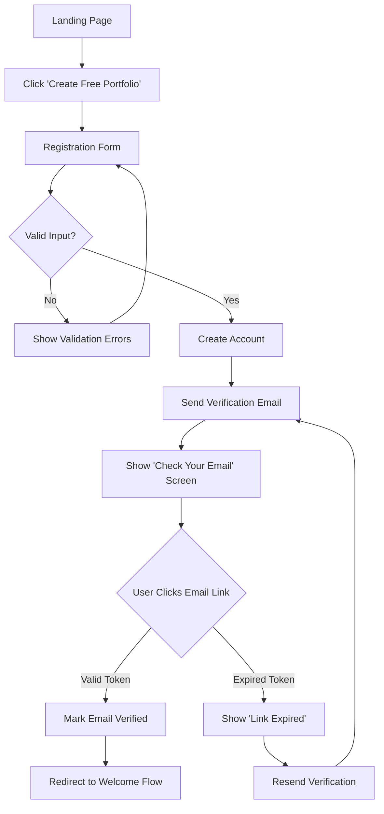

### 1.2 Asset Discovery Flow

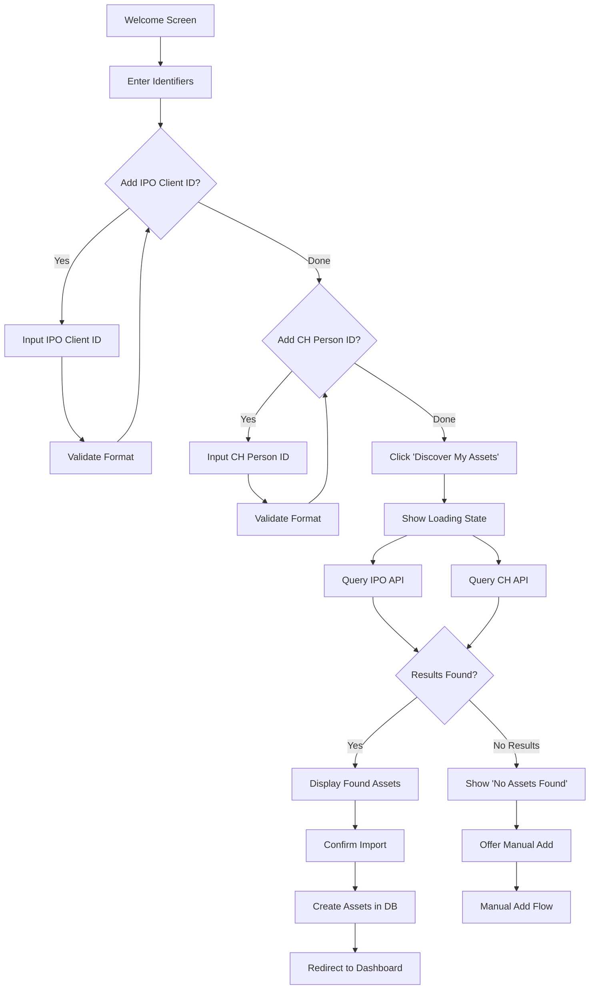

### 1.3 Manual Asset Addition Flow

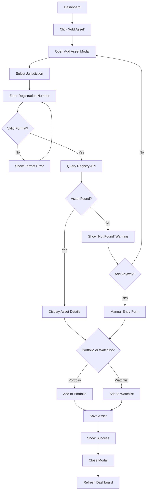

---

## Epic 2: Portfolio Dashboard

### 2.1 Dashboard Load Flow

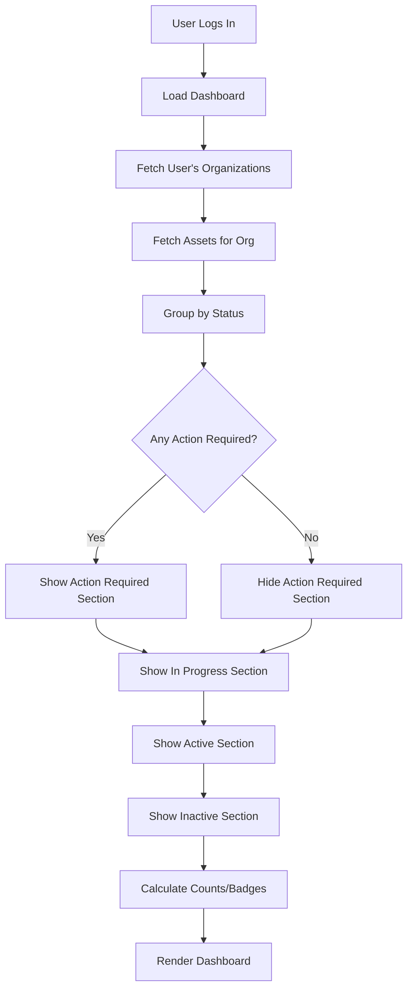

### 2.2 Portfolio/Watchlist Toggle

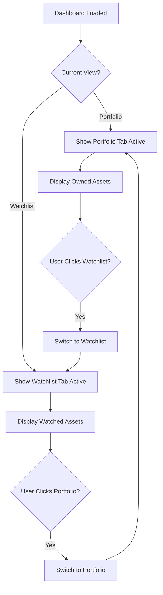

### 2.3 Asset Detail View

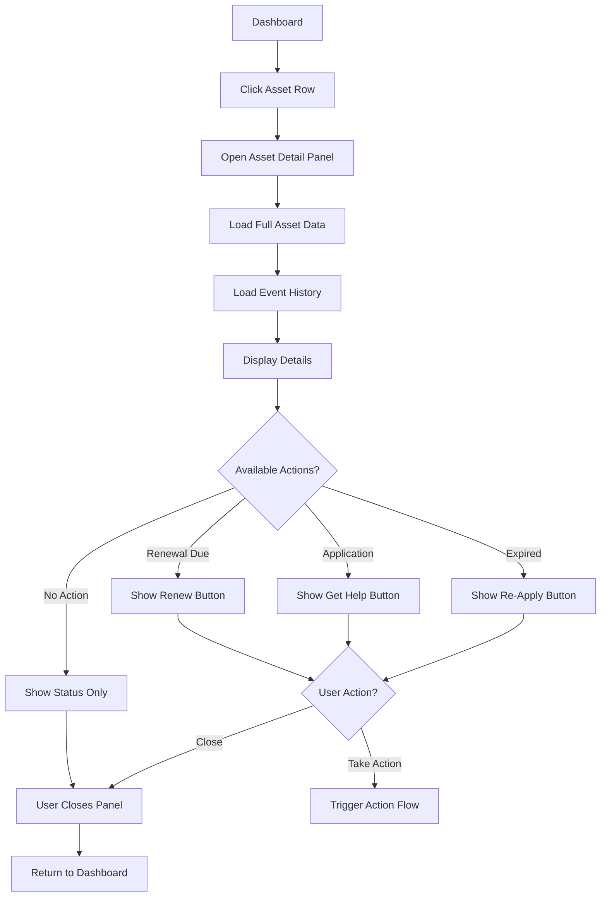

---

## Epic 3: Renewals & Actions

### 3.1 Renewal Flow

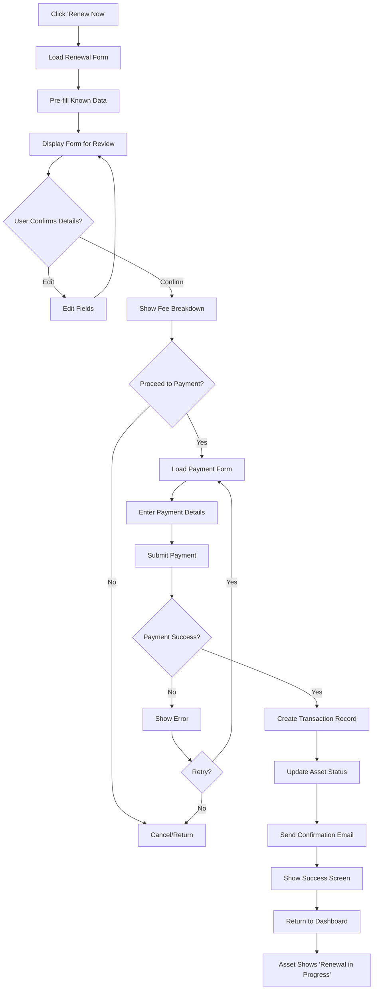

### 3.2 Get Help Flow

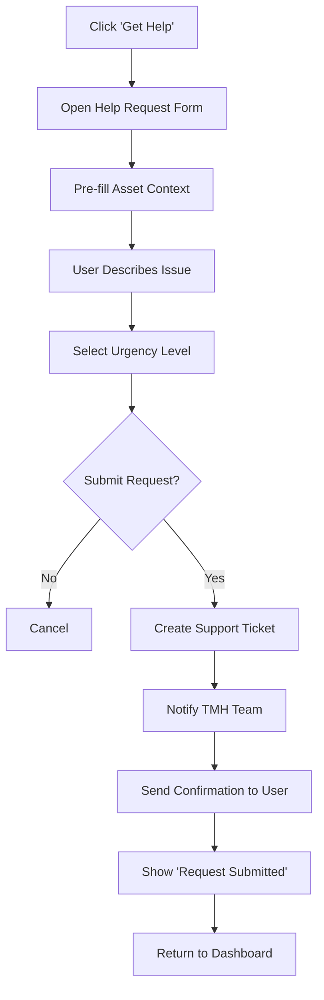

---

## Epic 4: Notifications & Digests

### 4.1 Weekly Digest Generation

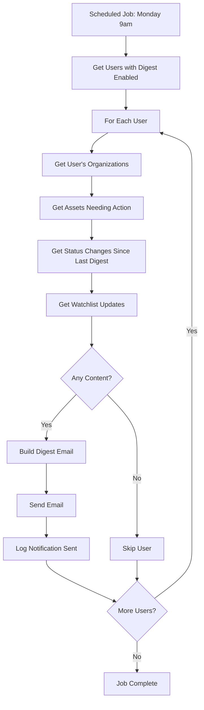

### 4.2 Urgent Alert Flow

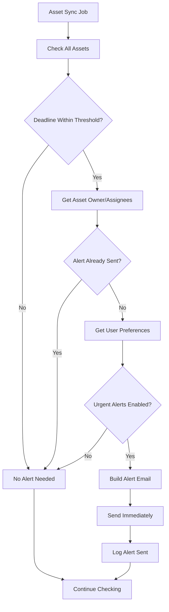

---

## Epic 5: Multi-Organization Management

### 5.1 Create Client Organization

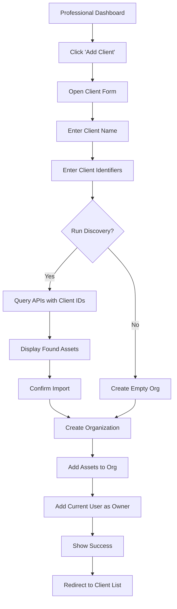

### 5.2 Client Overview Navigation

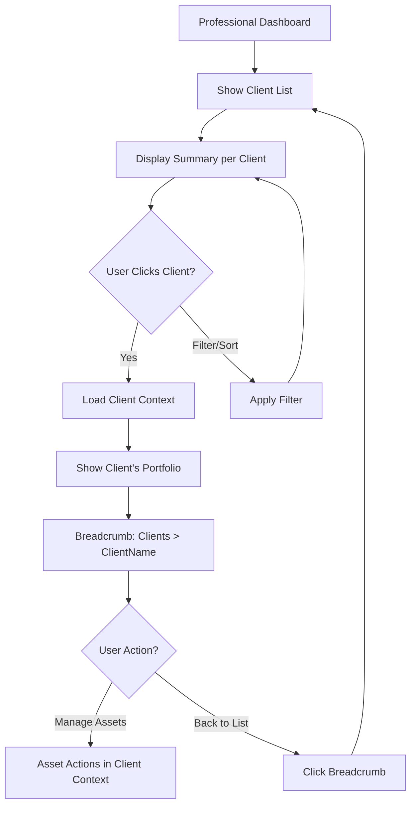

---

## Epic 6: Team & Role Management

### 6.1 Invite Team Member

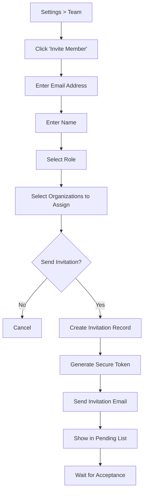

### 6.2 Accept Invitation

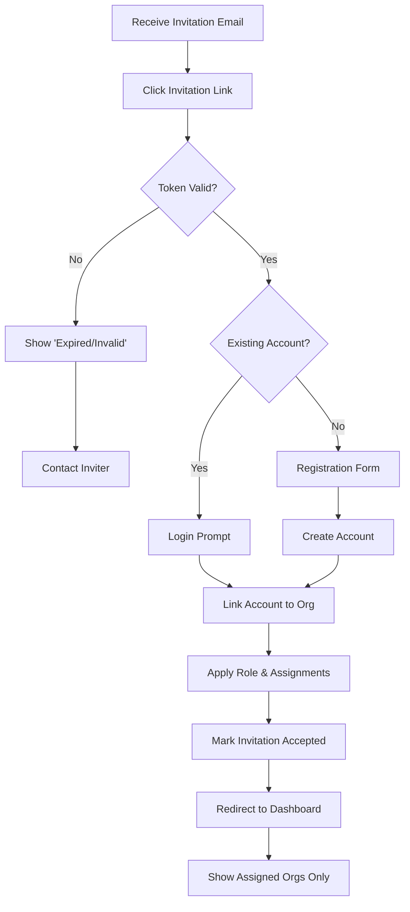

### 6.3 Role Permission Check

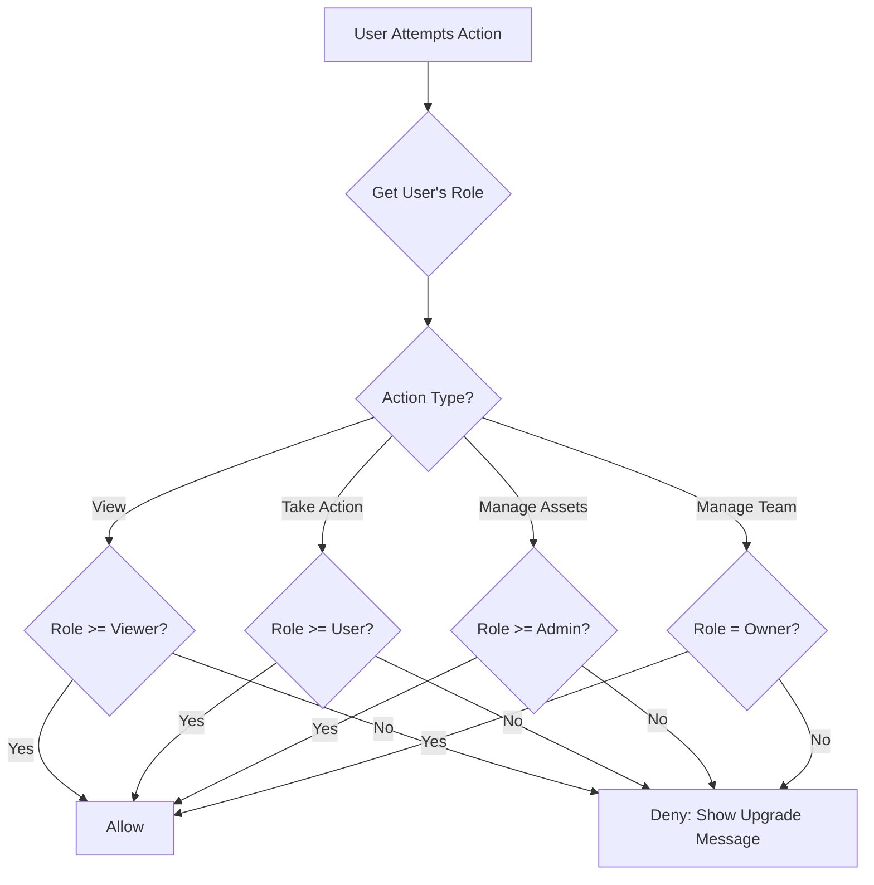

---

## Epic 7: Delegated Access (Assistant Model)

### 7.1 Invite Assistant with Assets

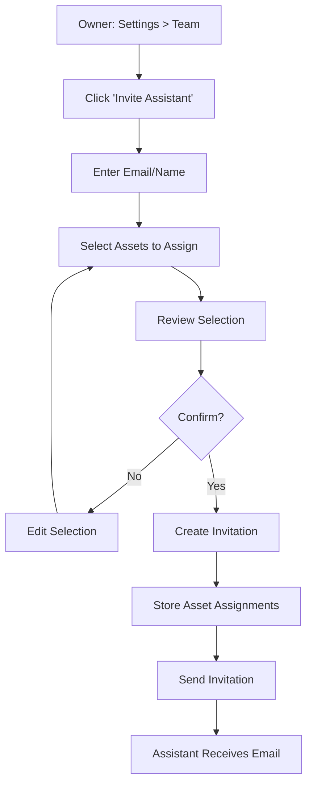

### 7.2 Assistant Dashboard Experience

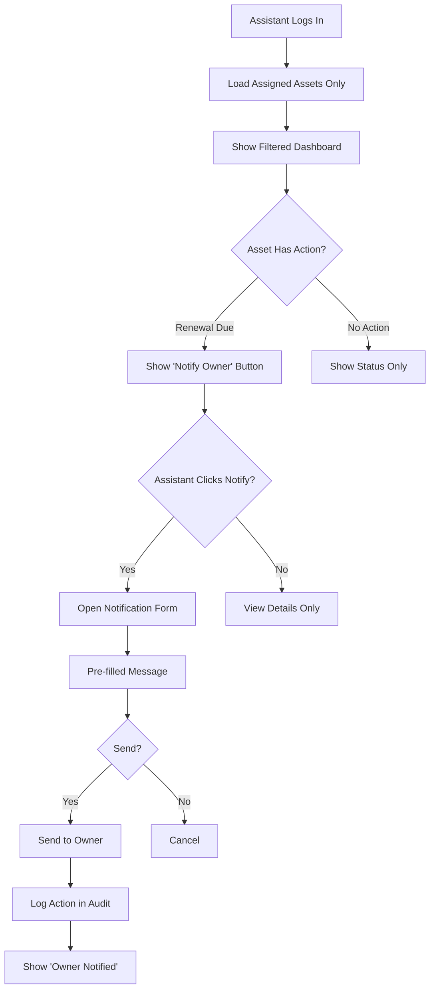

### 7.3 Notify Owner Flow

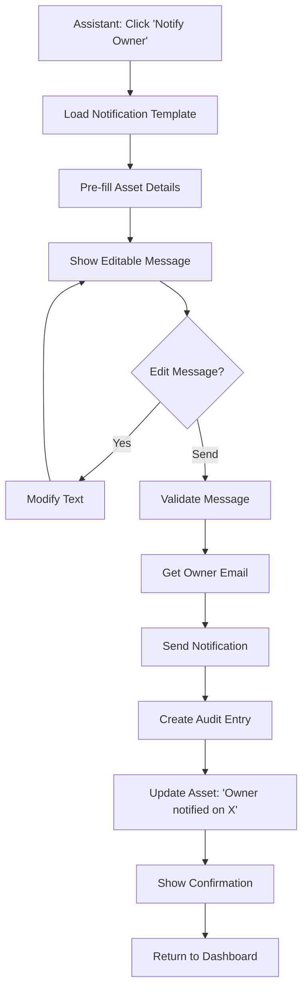

---

## Epic 8: Audit & Activity Logging

### 8.1 Audit Log Recording

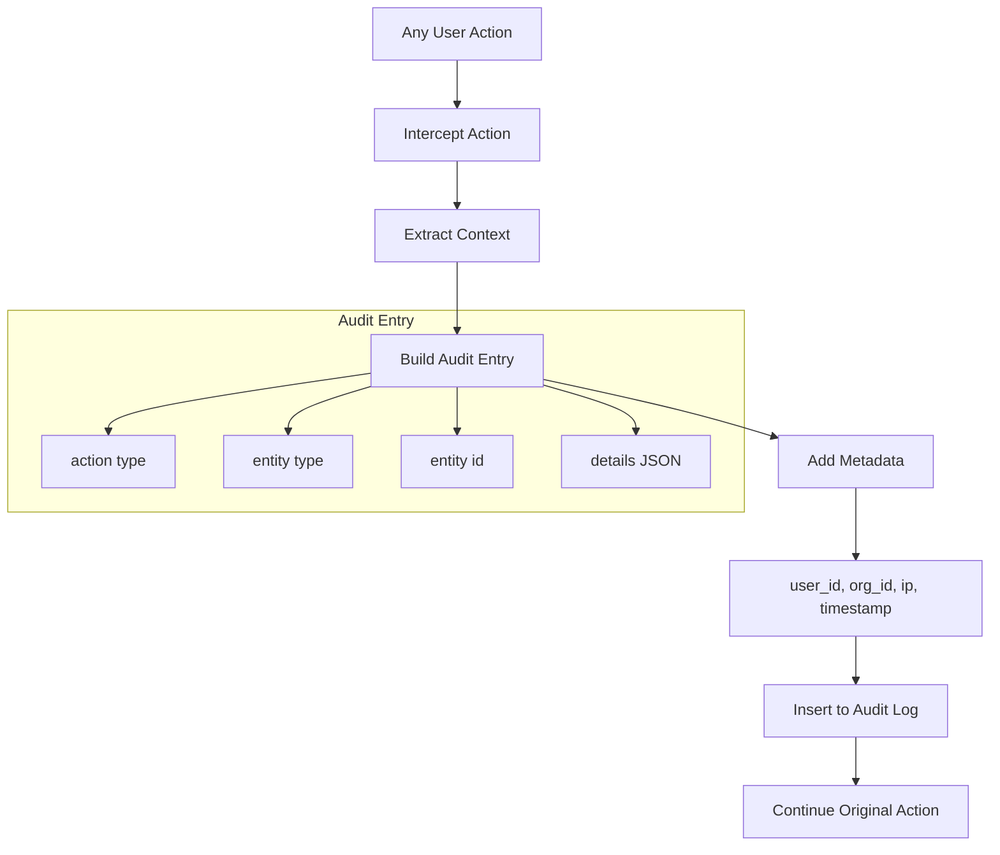

### 8.2 View Audit Log

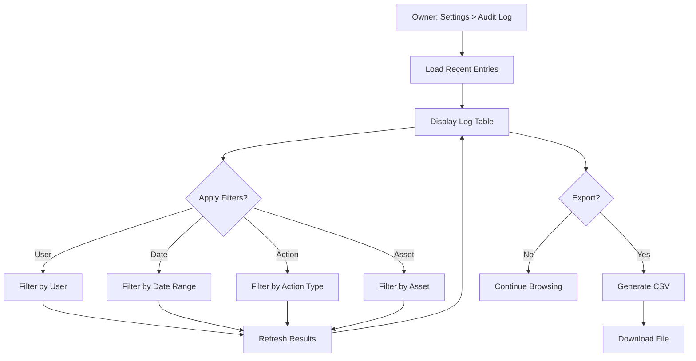

---

## Cross-Cutting: Authentication Flow

### Login Flow

```mermaid
flowchart TD
    A[Login Page] --> B[Enter Email/Password]
    B --> C{Valid Credentials?}
    C -->|No| D[Show Error]
    D --> E{Too Many Attempts?}
    E -->|Yes| F[Lock Account Temporarily]
    E -->|No| B
    C -->|Yes| G{Email Verified?}
    G -->|No| H[Prompt to Verify]
    H --> I[Resend Verification]
    G -->|Yes| J{2FA Enabled?}
    J -->|Yes| K[Enter 2FA Code]
    K --> L{Valid Code?}
    L -->|No| D
    L -->|Yes| M[Create Session]
    J -->|No| M
    M --> N[Log Login in Audit]
    N --> O[Redirect to Dashboard]
```

### Password Reset Flow

```mermaid
flowchart TD
    A[Click 'Forgot Password'] --> B[Enter Email]
    B --> C{Email Exists?}
    C -->|No| D[Show Generic Message]
    C -->|Yes| E[Generate Reset Token]
    E --> F[Send Reset Email]
    D --> G[Show 'Check Email' Message]
    F --> G
    G --> H{User Clicks Link}
    H --> I{Token Valid?}
    I -->|No| J[Show 'Link Expired']
    J --> A
    I -->|Yes| K[Show New Password Form]
    K --> L[Enter New Password]
    L --> M{Valid Password?}
    M -->|No| N[Show Requirements]
    N --> L
    M -->|Yes| O[Update Password]
    O --> P[Invalidate Token]
    P --> Q[Log Password Change]
    Q --> R[Redirect to Login]
```

---

## State Diagrams

### Asset Lifecycle States

```mermaid
stateDiagram-v2
    [*] --> ApplicationFiled: New Application
    ApplicationFiled --> Examination: Accepted for Exam
    ApplicationFiled --> Refused: Rejected
    ApplicationFiled --> Withdrawn: Withdrawn by Owner
    Examination --> Published: Passes Exam
    Examination --> Refused: Fails Exam
    Published --> Registered: No Opposition
    Published --> Refused: Opposition Succeeds
    Registered --> RenewalDue: Approaching Expiry
    RenewalDue --> Renewed: Payment Submitted
    RenewalDue --> RenewalOverdue: Deadline Passed
    Renewed --> Registered: Renewal Confirmed
    RenewalOverdue --> Expired: Grace Period Ends
    Expired --> [*]
    Registered --> Cancelled: Owner Request
    Cancelled --> [*]
    Refused --> [*]
    Withdrawn --> [*]
```

### Transaction States

```mermaid
stateDiagram-v2
    [*] --> Pending: Initiated
    Pending --> Processing: Payment Submitted
    Processing --> Completed: Payment Success
    Processing --> Failed: Payment Declined
    Failed --> Pending: Retry
    Failed --> [*]: Abandoned
    Completed --> Refunded: Refund Requested
    Refunded --> [*]
    Completed --> [*]
```

### Invitation States

```mermaid
stateDiagram-v2
    [*] --> Pending: Invitation Sent
    Pending --> Accepted: User Accepts
    Pending --> Expired: Time Limit Reached
    Pending --> Revoked: Owner Cancels
    Expired --> Pending: Resend
    Accepted --> [*]
    Revoked --> [*]
```

---

## Rendering Notes

These diagrams use **Mermaid.js** syntax and render natively in:
- GitHub / GitLab markdown preview
- VS Code (with Mermaid extension)
- Obsidian
- Notion (via embed)
- Most modern documentation platforms

To preview locally, you can use:
- [Mermaid Live Editor](https://mermaid.live)
- VS Code extension: "Markdown Preview Mermaid Support"
